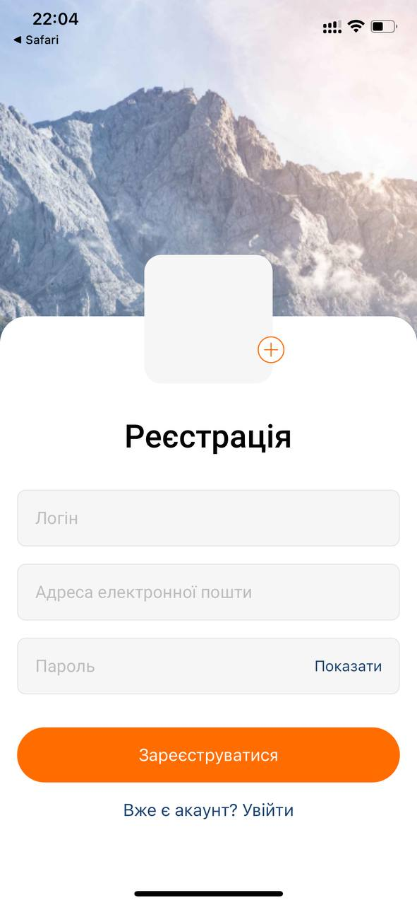

## About The Project

This application serves as a social networking platform designed for photo uploads and interactive commenting. 
Leveraging the power of Firebase, the app provides seamless user registration and login functionality. 
Additionally, Firebase is utilized for the storage of photos, comments, and other relevant data.

